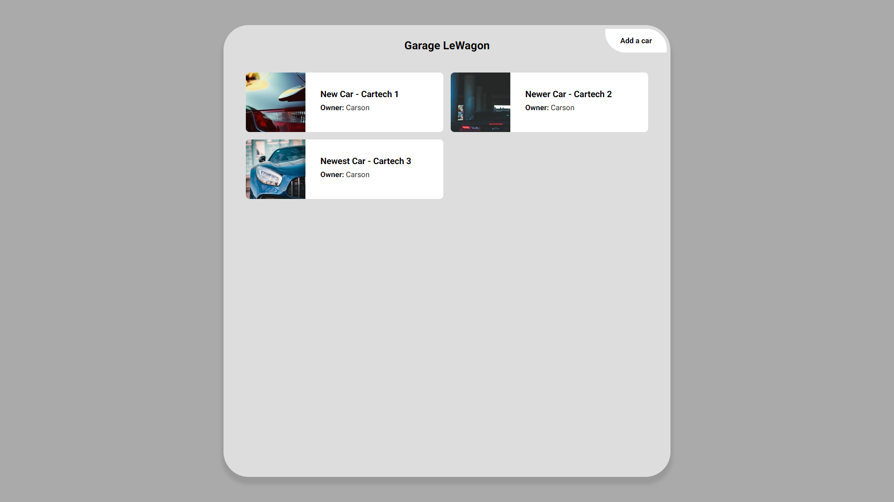
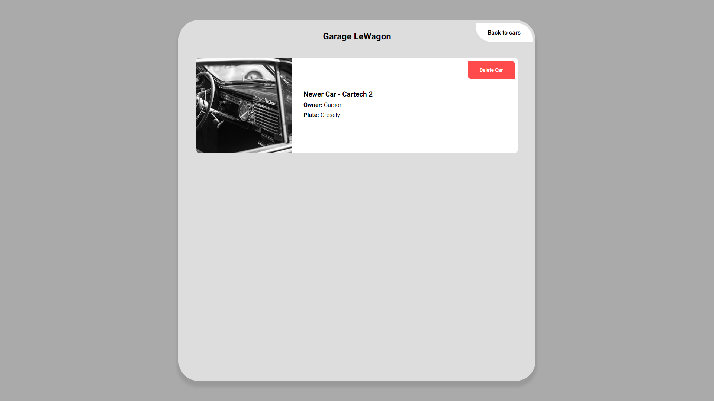
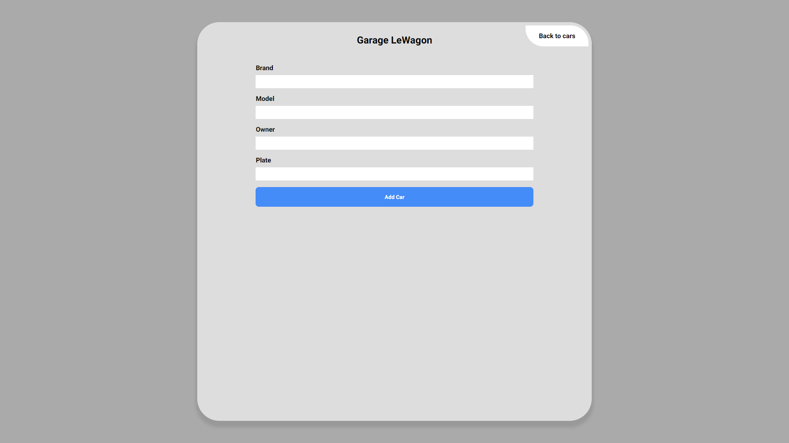

### Garage Redux

The goal of this challenge was to create a React-Redux app for keeping track of cars in a garage.
The app uses react-router to manage routes.

Here's how it looks:

#### 1. Setup

The challenge used the Le Wagon [Redux boilerplate](https://github.com/lewagon/redux-boilerplate) and Le Wagon [Garage API](https://github.com/lewagon/garage-api)

#### 2. Features

* Users can view a list of all their cars.
* Users can select a car to view more details.
* Users can add a car to their collection.

#### 3. Potential

* Improve styling for accessibility.
* Add mobile-first responsive capabilities.